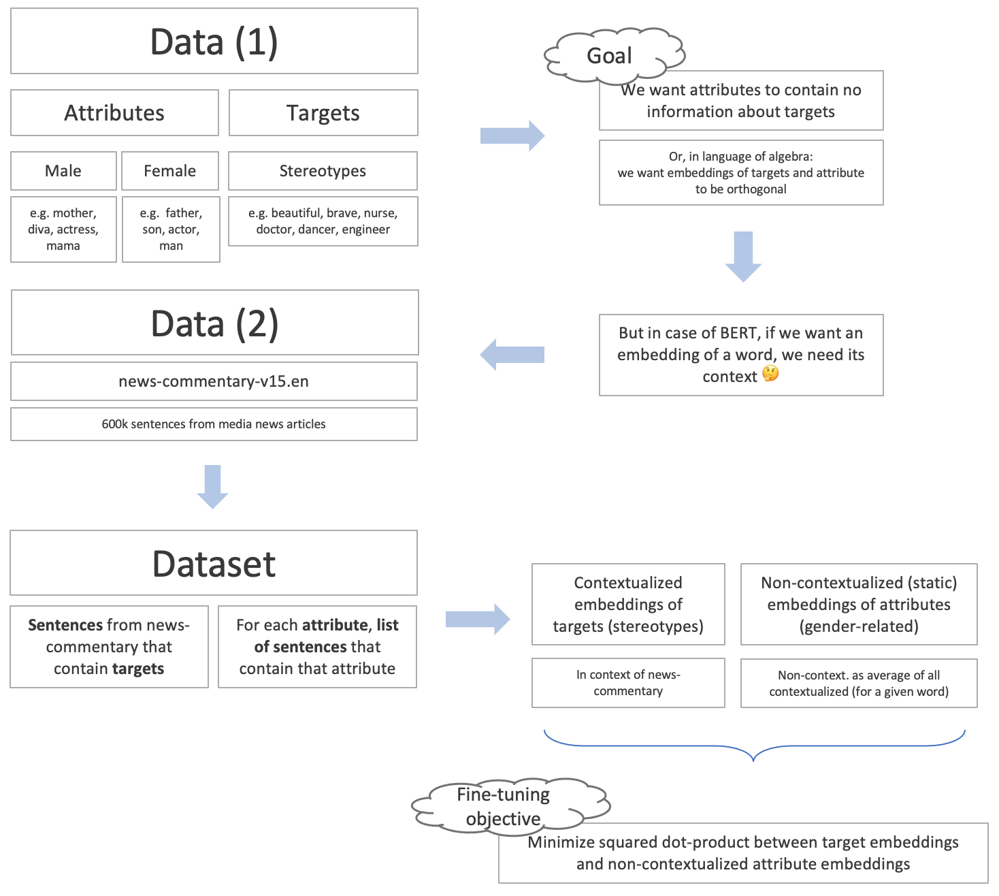

# Removing gender bias from pre-trained language models [WIP]

The aim of this project is to remove gender bias from pre-trained language
models, as described by [Kaneko et al](https://aclanthology.org/2021.eacl-main.107.pdf).
The idea, in brief, is to enforce _attribute_ and _target_ embeddings to be orthogonal via fine-tuning.
Think of _attributes_ as gender-related words (e.g man, woman), and _targets_ as stereotypes (e.g doctor, nurse).

**NB: This is a work in progress. The code will change and it will go beyond the scope of the original idea.**


## How to run
```bash
pip install -r requirements.txt
python run.py +debiaser.model_name='distilbert-base-uncased'
```
* The first run will download, process, and cache datasets.
* By default, debiasing will run on a single GPU. For more options, see [configs](configs/). 
    * This project uses [hydra](https://hydra.cc/docs/intro#quick-start-guide) for config managements and [pytorch lightning](https://www.pytorchlightning.ai/) for training loops. 
* [WIP] You can choose `model_name` ∈ {`bert-base-uncased`, `distilbert-base-uncased`, ~~`roberta-base`~~, ~~`albert-base-v2`~~, ~~`google/electra-small-discriminator`~~}.
    * These are pre-trained [🤗 transformers](https://huggingface.co/).

## How does the debiasing work?
The idea from the paper in a nutshell, a drawing by me:


### Technical difficulties
The code of the original paper does slightly different things than described above and in the original paper.
In particular, non-contextualized embeddings are computed not for every single instance of every attribute, but instead we have only two embeddings, standing for `masculine` and `feminine` dimensions.
They [motivate it](https://github.com/kanekomasahiro/context-debias/issues/2#issuecomment-938492138) for "faster computation" (indeed, it's 5 min vs 40 min on a single V100).
For reproducibility, I follow their implementation.


## Credits
* The original debiaing idea:
```bibtex
@inproceedings{kaneko-bollegala-2021-context,
    title={Debiasing Pre-trained Contextualised Embeddings},
    author={Masahiro Kaneko and Danushka Bollegala},
    booktitle = {Proc. of the 16th European Chapter of the Association for Computational Linguistics (EACL)},
    year={2021}
}
```
* Hydra+lightning template by [ashleve](https://github.com/ashleve/lightning-hydra-template).
